<h1 align="center">Max Oredson - Azure</h1>

Min enkla webbapplikation är byggd med PHP och nginx som körs i en Docker-container.

Applikationen körs tillsammans med en reverse proxy som hanterar inkommande trafik och vidarebefordrar den till rätt container. SSL-certifikat hanteras automatiskt via Let's Encrypt.

Hela bygg- och deployprocessen är automatiserad med GitHub Actions. Vid varje push byggs en ny Docker-image, som pushas till Docker Hub och deployas via SSH till en server där Docker Compose startar om containrarna med den nya versionen. Miljövariabler för domän och certifikat hanteras säkert via GitHub Secrets.

<p align="center" style="font-size: 20px; color: black;">
  <strong>GitHub Repo:</strong>
  <a href="https://github.com/91maxore-hub/php-app" style="color: black; font-weight: bold;">
    https://github.com/91maxore-hub/php-app
  </a>
  <br><br>
  <a href="https://wavvy.se" style="color: black; font-weight: bold;">
    https://wavvy.se
  </a>
</p>

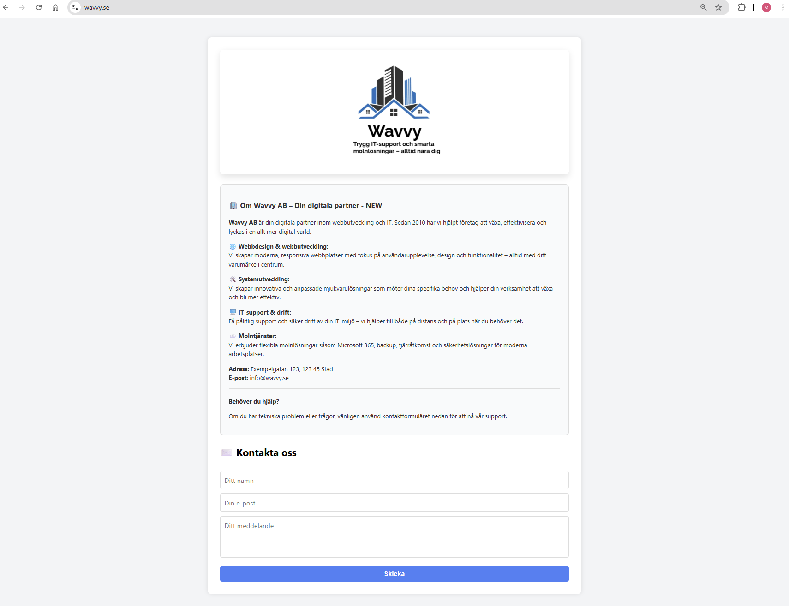

<div style="margin-top: 800px;"></div>

# Skapandet av projektstruktur och grundfiler

| Katalog / Fil            | Typ  | Beskrivning                                               |
| ------------------------ | ---- | --------------------------------------------------------- |
| `php-app`                | Mapp | Projektets rotmapp                                        |
| ├── `index.php`          | Fil  | Huvudfil för webbapplikationen                            |
| ├── `style.css`          | Fil  | CSS-stilmall för sidans utseende                          |
| ├── `logo2.png`          | Fil  | Bildfil – logotyp för webbplatsen                         |
| ├── `default.conf`       | Fil  | Nginx-konfiguration för webbserver och PHP-hantering      |
| ├── `docker-compose.yml` | Fil  | Startar app med reverse proxy och HTTPS via Let's Encrypt |
| └── `Dockerfile`         | Fil  | Dockerfil för att bygga image                             |
| `.github/workflows`      | Mapp | Mapp för GitHub Actions workflows                         |
| └── `docker-image.yml`   | Fil  | Workflow för att bygga, pusha och deploya Docker-image    |

Syftet med dessa filer är att skapa en minimal men fungerande webbsida som kan paketeras i en Docker-image.  
Tittar man på själv appens hemsida innehåller **index.php** själva innehållet för sidan, **style.css** står för designen, och **logo2.png** används som logobild för webbplatsen.  
Övriga filer kommer att presenteras med dess funktioner senare i dokumentationen.

<div style="margin-top: 800px;"></div>

# Skapandet av ett Docker Hub-repository

Efter att projektstrukturen var klar (med **index.php**, **style.css**, **logo2.png**), är det snart dags att paketera projektet i en Docker-image och publicera den på Docker Hub.
För att börja med detta måste man först skapa ett repository på Docker Hub som ska lagra och distribuera min Docker-image som jag döpte till **php-nginx-app** (Se bilden nedan)

Dessutom behövs en **Dockerfile** och en **default.conf** som jag kommer gå igenom efter vi skapat Docker Hub-repo och token.


## Följ stegen nedan för att skapa ett **Docker Hub-repository**

**Steg 1: Logga in på Docker Hub:**

Gå till [https://hub.docker.com/repositories/ditt-användarnamn](https://hub.docker.com/repositories/ditt-användarnamn)

**Steg 2: Navigera till dina repositories:**

Du kommer direkt till listan över repositories under ditt konto. 

<div style="page-break-inside: avoid;">
  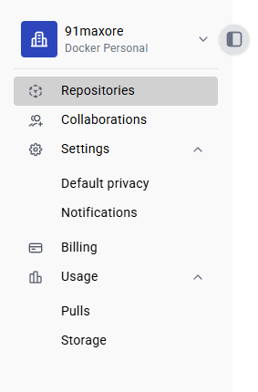
</div>

**Steg 3: Skapa ett nytt repository:**

Klicka på **"Create a Repository"** längst bort till höger.

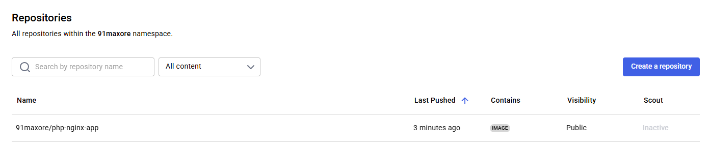

**Steg 4: Fyll i repository-information:**

- **Repository Name:** Ange ett namn för ditt repo, t.ex. `php-app` kommer bli **ditt-användarnamn**/`php-app` senare när du ska bygga och pusha Docker-image  
- **Visibility:** Välj om ditt repo ska vara **Public** eller **Private**  
- **Description:** Lägg till en kort beskrivning av vad repot innehåller  
- Klicka på **"Create"**

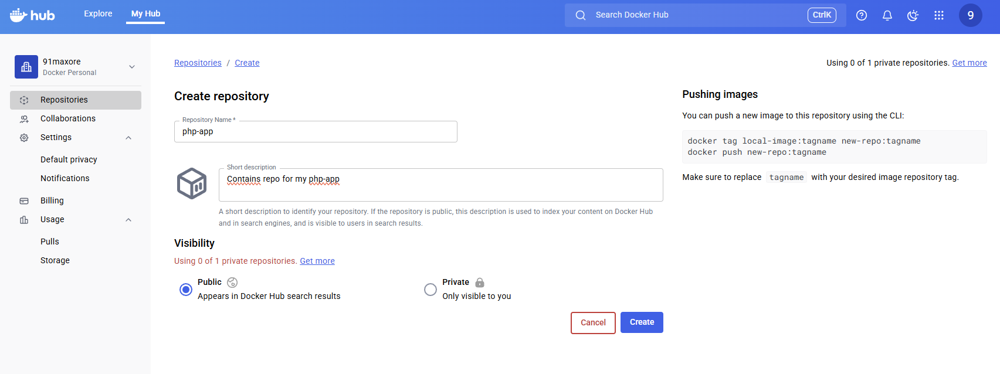

<div style="margin-top: 380px;"></div>

# Skapandet av Docker Hub-token

### Följ stegen nedan för att skapa en **Docker Hub-token** som senare kommer att sparas som GitHub Secret och användas för autentisering för CI/CD-deployment

**Steg 1: Navigera till Account Settings:**

Klicka på ditt profilnamn uppe till höger → välj **Account Settings**.

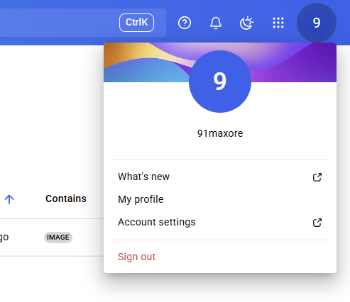

<div style="margin-top: 400px;"></div>

**Steg 2: Gå till Personal access tokens:**

I inställningsmenyn, klicka på **"Personal Access Tokens"**.


**Steg 3: Navigera till skapandet av token:**

Klicka på **"Generate New Token"** längst bort till höger.

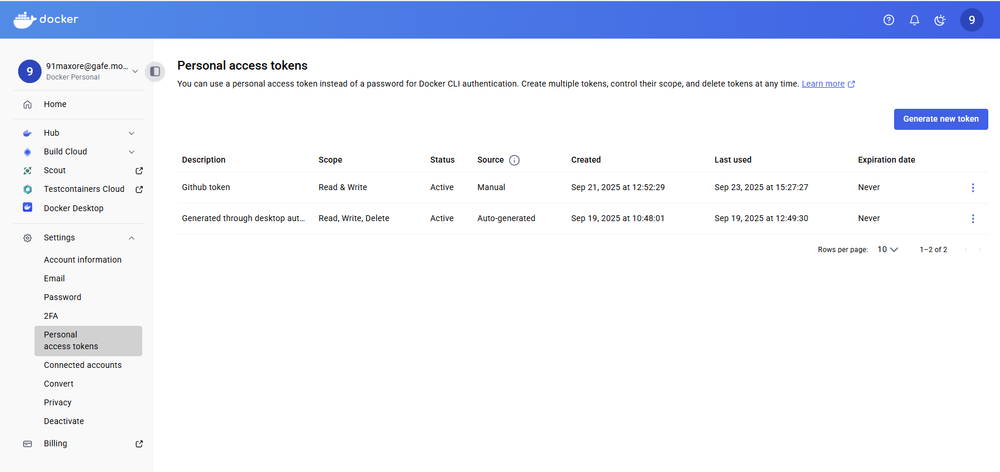

<div style="margin-top: 400px;"></div>

**Steg 4: Skapa en ny token**

- **Access token description:** Ge token ett namn, t.ex. `Docker Hub-token`
- **Access permissions:** Välj **Read & Write** för att möjliggöra både nedladdning (pull) och uppladdning (push) av images
- Klicka på **"Generate"**

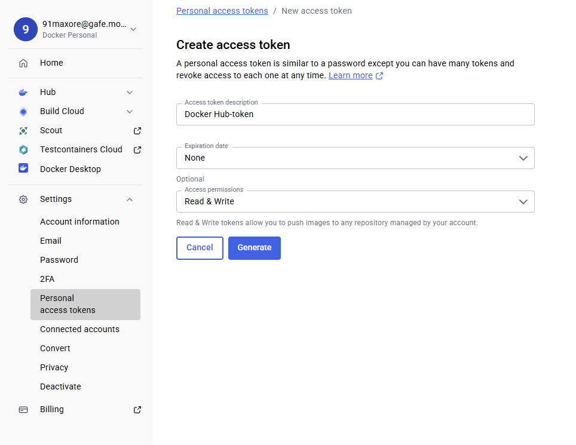

**Steg 5: Kopiera token direkt:**

Kopiera token direkt och spara den säkert. Du kommer **inte** kunna se den igen efteråt. Denna token kommer vi senare spara som en GitHub Secret och använda för CI/CD-deployment för att autentisera mot Docker Hub.

<div style="margin-top: 400px;"></div>

# Skapandet av Dockerfile

Jag skapade därefter en Dockerfile som installerar PHP 8.2 med FPM, nginx, och kopierar in mina applikations-filer från **php-app** (projektmappen) samt en egen nginx-konfiguration.  
**Kortfattat:** en Dockerfile är en fil som beskriver hur ens Docker-image ska byggas.

**Dockerfile** (php-app/Dockerfile) gör följande:

1. Använder officiell PHP 8.2 som grund.
2. Uppdaterar paketlistan och installerar nginx webbserver, sen rensar cache för att hålla image liten.
3. Tar bort standardfiler i nginx webbroot och kopierar in applikationens filer dit.
4. Byter arbetskatalog till webbroot och kopierar en egen nginx-konfigurationsfil.
5. Exponerar port 80 och startar php-fpm i bakgrunden samt nginx i förgrunden för att hantera webbtrafiken.

## 📄 Dockerfile

```Dockerfile
# Använd officiell PHP 8.2 FPM image som bas (PHP med FastCGI Process Manager)
FROM php:8.2-fpm

# Uppdatera paketlistan och installera Nginx webbserver
RUN apt-get update && \
    apt-get install -y nginx && \
    apt-get clean && \
    rm -rf /var/lib/apt/lists/*  # Rensa cache för att hålla image liten

# Ta bort standardfiler i Nginx webbroot för att undvika att visa standardstartsidan
RUN rm -rf /var/www/html/*

# Kopiera applikationens filer från din dator till containerns webbrot
COPY . /var/www/html

# Byt arbetskatalog till webbrot, där index.php ligger
WORKDIR /var/www/html

# Kopiera din egen Nginx-konfiguration till standardplats
COPY default.conf /etc/nginx/sites-available/default

# Exponera port 80 för webbtrafik utanför containern
EXPOSE 80

# Starta php-fpm i bakgrunden och nginx i förgrunden
CMD ["bash", "-c", "php-fpm & nginx -g 'daemon off;'"]
```

<div style="margin-top: 400px;"></div>

# Skapandet av nginx-konfiguration (default.conf)

Jag skapade även **default.conf** som är en typ av nginx-konfigurations fil, där jag konfigurerade nginx att peka på rätt katalog och hantera PHP-filer.
Den styr även hur webbservern hanterar filer och PHP-kod för att säkerställa att webbplatsen fungerar korrekt och säkert.

**default.conf** (php-app/default.conf) gör följande:

1. Lyssnar på port 80 för HTTP-förfrågningar.
2. Redirectar automatiskt HTTP-förfrågningar till HTTPS.
3. Anger webbrot och standardfil (`index.php`).
4. Hanterar förfrågningar och skickar saknade filer till `index.php`.
5. Serverar statiska filer direkt utan PHP.
6. Skickar PHP-filer till PHP-FPM för bearbetning.

## 📄 default.conf

```default.conf
server {
    listen 80;
    server_name localhost;

    # Om förfrågan inte kommer via HTTPS enligt reverse proxy, gör redirect
    if ($http_x_forwarded_proto != "https") {
        return 301 https://$host$request_uri;
    }

    root /var/www/html;
    index index.php index.html;

    location / {
        try_files $uri $uri/ /index.php?$query_string;
    }

    location ~* \.(css|js|jpg|jpeg|png|gif|ico|svg)$ {
        try_files $uri =404;
    }

    location ~ \.php$ {
        include fastcgi_params;
        fastcgi_pass 127.0.0.1:9000;
        fastcgi_index index.php;
        fastcgi_param SCRIPT_FILENAME $document_root$fastcgi_script_name;
    }

    location ~ /\.ht {
        deny all;
    }
}
```

# Byggandet av Docker Image och ladda upp till Docker Hub

### Nu är det dags att gå igenom stegen för att paketera projektet i en Docker-image och publicera den på Docker Hub

**Steg 1: Byggandet av Docker Image**

Jag använde terminalen och angav följande kommando i projektmappen (där appens samtliga filer finns) för att bygga mina applikations-filer till en Docker-image och ge den en tagg.  

**91maxore** = användarnamn  
**php-nginx-app** = repo på Docker Hub

```bash
docker build -t 91maxore/php-nginx-app:latest .
```

**Steg 2: Logga in på Docker Hub**

Logga in på Docker Hub via terminalen:
```bash
docker login
```

Angav mitt användarnamn och lösenord som jag använder till Docker Hub.


**Steg 3: Pusha Docker-image till Docker Hub**

När imagen är byggd och du är inloggad, pusha imagen till Docker Hub med:
```bash
docker push 91maxore/php-nginx-app:latest
```

Detta pushar min nyskapade Docker-image till Docker Hub och är redo för användning.  
Nu ligger den på Docker Hub:

🔗 https://hub.docker.com/repository/docker/91maxore/php-nginx-app/

**Steg 4: Testa containern lokalt**  
Innan vi går vidare behöver vi först testa att containern fungerar som den ska, och därmed testar vi den lokalt först.  Så jag började med att testköra den med:
```bash
docker run -d -p 8080:80 91maxore/php-nginx-app:latest
```

**Notera:** Att den mappar port 80 inne i containern (där nginx kör) till port 8080 lokalt på min dator.

**Steg 5: Kontrollera att containern körs**  
För att se om containern är igång kan du använda:

```bash
docker ps
```

Detta borde returneras med din container, ex. **91maxore/php-nginx-app** i mitt fall.

Sedan kunde jag öppna webappen i webbläsaren via:
```bash
http://localhost:8080
```

Där laddades min PHP-webapp utan konstigheter. Se bild nedan.

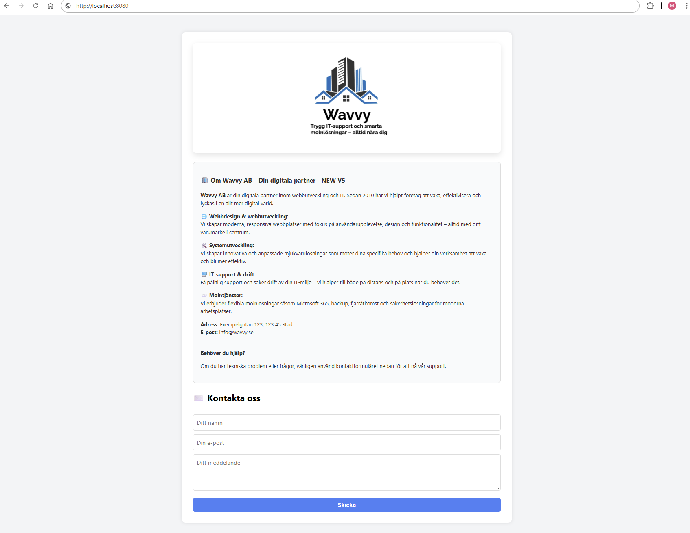

<div style="margin-top: 400px;"></div>

# Köra i en Container Host

Efter att jag byggt och laddat upp Docker-imagen till Docker Hub, samt testat dess funktionalitet lokalt på datorn (som du kan läsa ovan)  Så är nästa steg att få en Azure VM att köra containern, så att appen kan nås därifrån via sitt publika IP hela tiden.

**Konfiguration av Container Host**

| **Parameter**  | **Värde**                          |
| -------------- | ---------------------------------- |
| **Namn**       | PHP-APP-VM                         |
| **Region**     | North Europe                       |
| **Image**      | Ubuntu Server 22.04 LTS – x64 Gen2 |
| **Storlek**    | Standard\_B1s (1 vCPU, 1 GiB RAM)  |
| **Publikt IP** | 4.231.236.186                      |

**Port 80** - Används för att ta emot inkommande HTTP-trafik.  
**Port 443** - Används för att ta emot inkommande HTTPS-trafik (krypterad webbtrafik via SSL/TLS).  
**Port 22** - Används för att möjliggöra fjärrinloggning via SSH (GitHub Actions) för deployment av Docker-image till servern.  

**Steg 1: Logga in på servern via SSH:**
```bash
ssh -i ~/Downloads/php-VM_key.pem azureuser@4.231.236.186
```

**Steg 2: Installera Docker:**
```bash
sudo apt update
sudo apt install docker.io -y
```

**Steg 3: Dra ner din Docker-image från Docker Hub**  
På din container host (Azure VM) kör detta kommando för att hämta din image:
```bash
docker pull 91maxore/php-nginx-app:latest
```

<div style="margin-top: 400px;"></div>

**Steg 4: Kör containern**  
Starta containern och exponera port 80 så att appen blir tillgänglig på serverns port 80 genom att ange följande:
```bash
docker run -d --name php-nginx-app -p 80:80  91maxore/php-nginx-app:latest
```

**--name** gör så att du enkelt kan namnge din container så du enklare kan hålla koll på vilken container som är vad

**Notera:** Att jag inte behövde utföra docker login eftersom docker-imagen är publik.
Dessutom kör vi containern på port 80 så att man slipper ange porten efter ip-adressen. (ex. http://4.231.236.186)

**Steg 5: Kontrollera att containern körs**  
För att se om containern är igång kan du använda:

```bash
docker ps
```

Du ser då något liknande:

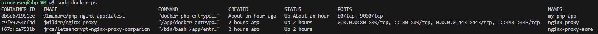

Nu har jag dock flera container som körs eftersom jag kör reverse proxy + HTTPS/SSL. Men dit kommer vi senare, men du förstår poängen.

**Tips:**

För att stoppa, starta och ta bort containern, kan du utföra följande:
```bash
docker stop php-nginx-app (eller container-id)
docker start php-nginx-app (eller container-id)
docker rm php-nginx-app (eller container-id)
```

Du bör se din container **php-nginx-app** (eller det du namngav din container ovan efter **--name**)

<div style="margin-top: 400px;"></div>

**Steg 6: Testa appens funktionalitet**  
Gå till serverns publika IP-adress i webbläsaren:
```bash
http://4.231.236.186
```

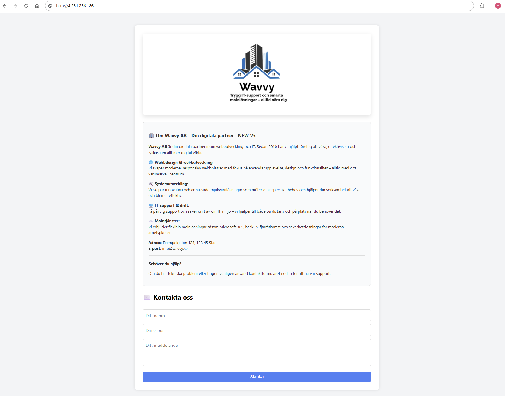

**Notera:** Att appen körs nu i en Docker-container på min container-host och är åtkomlig via dess publika IP.

**Det är viktigt att notera att port 80 (för HTTP) och/eller port 443 (för HTTPS) behöver vara öppen i brandväggen på Azure för att sidan ska kunna nås.**
**Tänk på att du kan behöva använda sudo om du inte har root-permissions.**

<div style="margin-top: 400px;"></div>

# 🌐 Domän istället för publikt IP (wavvy.se via Loopia)

För att göra webappen tillgänglig via ett eget domännamn, valde jag att koppla min domän **wavvy.se** som jag köpt via Loopia, till container-hosten istället för att använda dess publik IP-adress direkt. Främst eftersom jag inte vill exponera serverns publika IP.

Jag loggade in på Loopia och gick till DNS-inställningarna för domänen. Där uppdaterade jag A-posten så att wavvy.se pekar på min servers publika IP-adress. Efter en stund kunde appen nås via http://wavvy.se

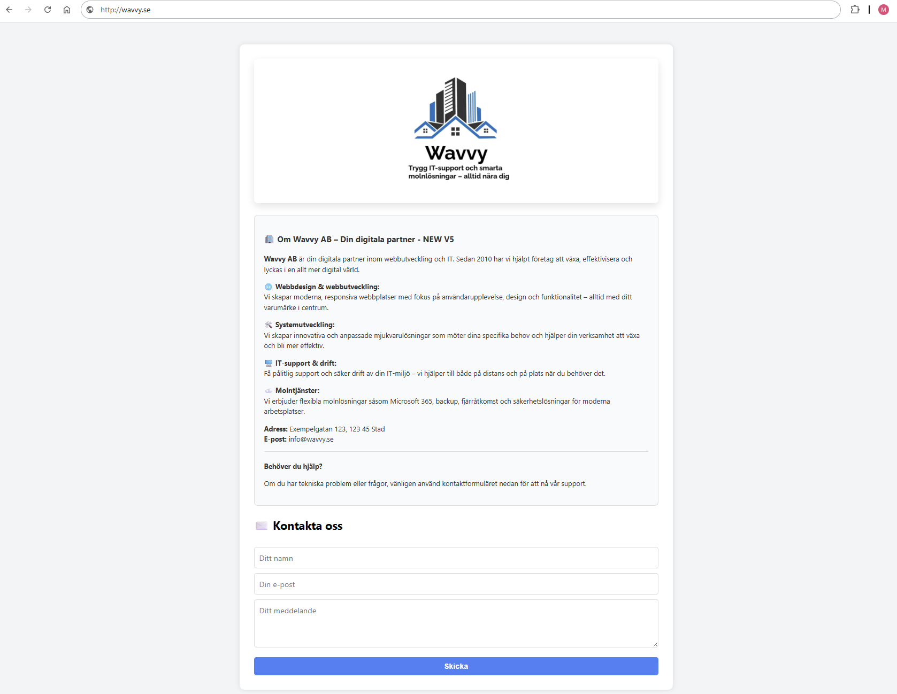

<div style="margin-top: 400px;"></div>

# 🔁 Reverse Proxy och HTTPS med Docker + Let's Encrypt

För att säkra min webbapp och göra den tillgänglig via HTTPS, satte jag upp en reverse proxy med automatiskt SSL-certifikat från Let's Encrypt.

**Jag använder tre containrar:**

1. Min **php-nginx-app** (från Docker Hub) - namngav den **my-php-app**
2. **nginx-proxy** – reverse proxy som lyssnar på trafik och omdirigerar till rätt container
3. **nginx-proxy-acme** – genererar och hanterar SSL-certifikat automatiskt

**Steg 1: Skapa en mapp för projektet på container-hosten**

Jag började med att skapa en mapp som heter **nginx-reverse-proxy** för appen som kommer ligga placerad på container-hosten (Azure VM).  Den kommer att användas för att lagra **docker-compose.yml** och tillhörande filer till HTTPS (Let's Encrypt) som certs etc.

```bash
mkdir -p ~/nginx-reverse-proxy
cd ~/nginx-reverse-proxy
```

**Steg 2: Skapa docker-compose.yml**

**Docker Compose-filen** (php-app/docker-compose.yml) gör följande:

1. Startar en PHP + nginx-app med miljövariabler för domän och certifikat.
2. Startar en nginx reverse proxy för att hantera trafik och SSL.
3. Startar en tjänst som automatiskt fixar och förnyar SSL-certifikat.
4. Delar volymer för certifikat och konfiguration mellan tjänsterna.
5. Kopplar ihop allt i ett gemensamt Docker-nätverk.  

Jag placerade **docker-compose.yml** i samma mapp som vi skapade i förgående steg (**nginx-reverse-proxy**) med följande innehåll som definierade alla tre containrar:

<div style="margin-top: 400px;"></div>

## 📄 docker-compose.yml

```yaml
version: '3'

services:
  app:
    image: 91maxore/php-nginx-app:latest
    container_name: my-php-app
    restart: unless-stopped
    expose:
      - "80"
    environment:
      - VIRTUAL_HOST=${VIRTUAL_HOST}
      - LETSENCRYPT_HOST=${LETSENCRYPT_HOST}
      - LETSENCRYPT_EMAIL=${LETSENCRYPT_EMAIL}
    networks:
      - webnet

  reverse-proxy:
    image: jwilder/nginx-proxy
    container_name: nginx-proxy
    restart: unless-stopped
    ports:
      - "80:80"
      - "443:443"
    volumes:
      - /var/run/docker.sock:/tmp/docker.sock:ro
      - ./certs:/etc/nginx/certs:ro
      - ./vhost.d:/etc/nginx/vhost.d
      - ./html:/usr/share/nginx/html
    networks:
      - webnet

  letsencrypt:
    image: jrcs/letsencrypt-nginx-proxy-companion
    container_name: nginx-proxy-acme
    restart: unless-stopped
    environment:
      - NGINX_PROXY_CONTAINER=nginx-proxy
    volumes:
      - /var/run/docker.sock:/var/run/docker.sock:ro
      - ./certs:/etc/nginx/certs:rw
      - ./vhost.d:/etc/nginx/vhost.d
      - ./html:/usr/share/nginx/html
    networks:
      - webnet

networks:
  webnet:
    driver: bridge
```

**Steg 4: Starta containers**

Kör följande för att dra ner och starta alla containrar:
```bash
docker-compose pull
```
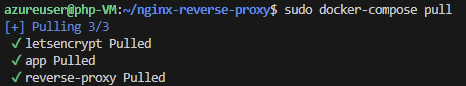

```bash
docker-compose up -d
```
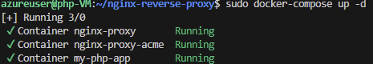

**Steg 5: Kontrollera att allt fungerar**

Surfa in på domänen och testa ifall HTTPS/SSL fungerar i webbläsaren:
```bash
https://wavvy.se
```

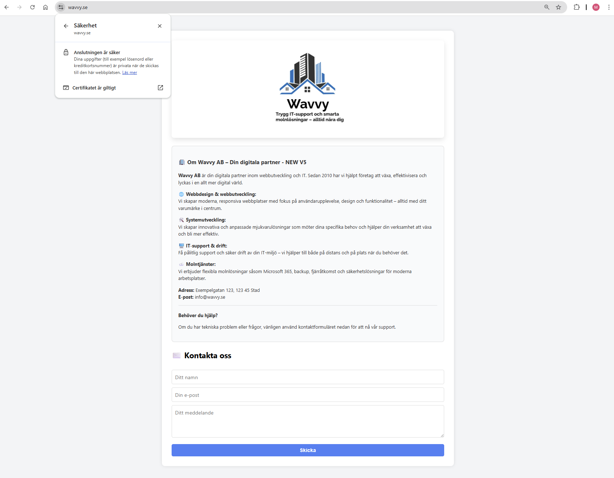

Vi kan därmed granska att appen fungerar som den ska med HTTPS/SSL. Du kan även se på bilden att **anslutningen är säker** och att **certifikatet är giltigt.**

Allt detta kommer sedan CI/CD via GitHub Actions lösa automatiskt via sin deployment-image, men vi testkör först dess funktionalitet för att se att allt fungerar som det ska.

<div style="margin-top: 400px;"></div>

# 🔒 Automatisk HTTPS med miljövariabler

För att konfigurera SSL och domännamnet använde jag tre miljövariabler som app-containern läser in: (under **environment**-delen i docker-compose.yml)

1. **VIRTUAL_HOST** – domännamnet (wavvy.se)
2. **LETSENCRYPT_HOST** – domännamnet som certifikatet ska utfärdas för (wavvy.se)
3. **LETSENCRYPT_EMAIL** – min e-postadress för Let's Encrypt (91maxore@gafe.molndal.se)

Dessa värden sattes i en .env-fil, som senare under CI/CD kommer att genereras automatiskt av GitHub Actions under deployment.  
Filen placeras i **nginx-reverse-proxy**-mappen som allt som rör docker/reverse proxy-konfiguration på container-hosten.

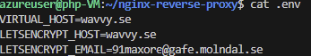

# 🚀 Automatiserad deployment med GitHub Actions

För att förenkla hela automatiseringsprocessen byggde och pushade jag min Docker-image automatiskt via GitHub Actions, och deployade den sedan direkt till servern via SSH. Allt detta kommer ske via min **docker-image.yml**

**Steg 1. Initiera Git-repo**  
Öppna terminalen och bege dig till projektmappen där appens filer ligger på din lokala dator ex.

```bash
cd ~/php-app
```

**Steg 2: Initiera ett nytt Git-repo och gör första commit direkt:**
```bash
git init && git add . && git commit -m "CI/CD Pipeline - Första commit"
```
<div style="margin-top: 400px;"></div>

**Steg 3: Skapa GitHub-repo**  
Bege dig över till ditt GitHub-konto och skapa ett nytt repo på GitHub. (jag döpte min till **php-app2** enbart för att demonstrera)
Efter att du skapat ditt repo kommer du bli hänvisad till följande instruktioner som du kan se nedan på bilden. Kopiera **Quick setup**-länken och följ vidare instruktionerna på mitt nästa steg.

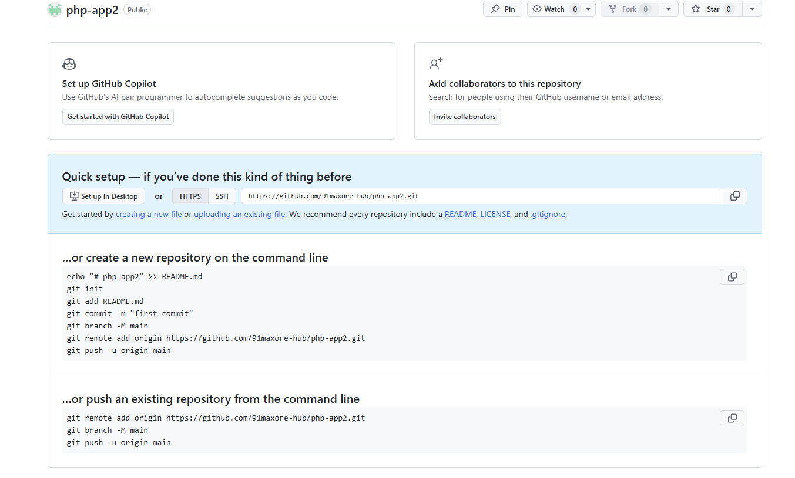

**Steg 4: Anslut lokalt repo till GitHub och gör första pushen**
```bash
git remote add origin git@github.com:91maxore-hub/php-app.git (ersätt med quick-setup länken)
git branch -M master (eller main)
git push -u origin master (eller main)
```

Jag har nu initierat GitHub-repot och det är redo att användas för CI/CD-deployments.

**Steg 5. Skapa GitHub Actions workflow**  
Nästa steg är att skapa en **docker-image.yml** för upprätthålla en CI/CD.  
Så skapa mappen och workflow-filen enligt strukturen som nedan:

```bash
mkdir -p .github/workflows
```

<div style="margin-top: 400px;"></div>

**Workflow-filen** (.github/workflows/docker-image.yml) gör följande:

1. Klona repot från GitHub
2. Loggar in på Docker Hub
3. Bygger Docker-imagen
4. Pushar den till Docker Hub
5. Ansluter till servern via SSH
6. Skapar .env-fil på container-hosten med hjälp av GitHub Secrets
7. Uppdaterar och startar containrarna med Docker Compose  
(Kör **docker-compose pull** och **docker-compose up -d** för att rulla ut den nya imagen)

<div style="margin-top: 800px;"></div>

## 📄 docker-image.yml

```yaml
name: Bygg och pusha Docker-image

on:
  push:
    branches: [ "master" ]

jobs:
  build-and-push:
    runs-on: ubuntu-latest

    steps:
      - name: 🛒 Klona repo
        uses: actions/checkout@v3

      - name: 🐳 Logga in på Docker Hub
        uses: docker/login-action@v2
        with:
          username: ${{ secrets.DOCKERHUB_USERNAME }}
          password: ${{ secrets.DOCKERHUB_TOKEN }}

      - name: 🔨 Bygg Docker-image
        run: |
          docker build -t 91maxore/php-nginx-app:latest .

      - name: 📤 Pusha till Docker Hub
        run: |
          docker push 91maxore/php-nginx-app:latest

      - name: 🚀 Deploya till server
        uses: appleboy/ssh-action@v0.1.7
        with:
          host: ${{ secrets.SERVER_HOST }}
          username: ${{ secrets.SERVER_USER }}
          key: ${{ secrets.SERVER_SSH_KEY }}
          script: |
            cd /home/azureuser/nginx-reverse-proxy

            # Skapa/skriv över .env-fil med hemliga variabler
            echo "VIRTUAL_HOST=${{ secrets.VIRTUAL_HOST }}" > .env
            echo "LETSENCRYPT_HOST=${{ secrets.LETSENCRYPT_HOST }}" >> .env
            echo "LETSENCRYPT_EMAIL=${{ secrets.LETSENCRYPT_EMAIL }}" >> .env

            # Starta om containrarna, docker-compose läser nu variabler från .env-filen
            sudo docker-compose pull
            sudo docker-compose up -d
```

<div style="margin-top: 400px;"></div>

# 🔒 Så här lägger du till en GitHub Secret

1. Öppna ditt repo på GitHub (ex. https://github.com/91maxore-hub/php-app)
2. Navigera till fliken **Settings**
3. Navigera till **Secrets and variables → Actions**
4. Klicka på **"New repository secret"**
5. Fyll i:
    - **Name** – t.ex. `SERVER_HOST`
    - **Secret** – `4.231.236.186`
6. Spara med **"Add secret"**

Enligt bästa praxis ska inga känsliga värden, såsom IP-adresser, domännamn, SSH-nycklar eller e-postadresser etc. hårdkodas i koden. Istället lagras desssa uppgifter säkert som GitHub Secrets i repot för att skydda dem från obehörig åtkomst och för att underlätta säker hantering.

# 🔒 GitHub Secrets-konfigurationer

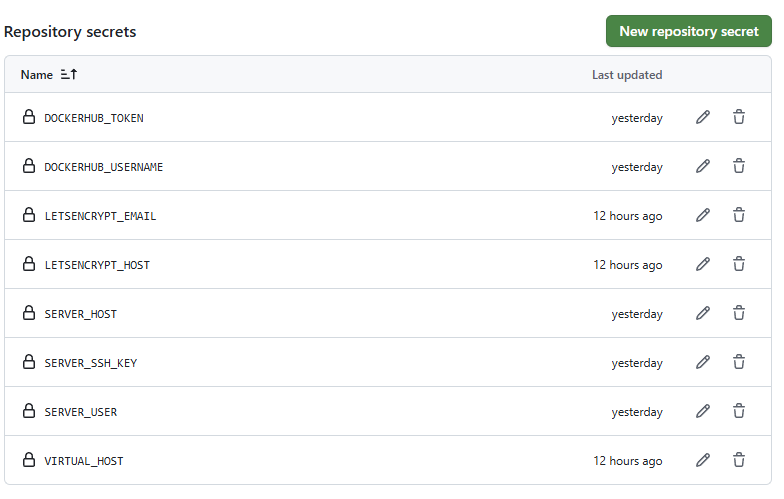

<div style="margin-top: 400px;"></div>

# 🔒 GitHub Secrets-tabell

| 🔒 **Secret**        | 💬 **Beskrivning / Värde**                                                            |
| -------------------- | -------------------------------------------------------------------------------------- |
| `DOCKERHUB_USERNAME` | **Användarnamn för Docker Hub** – `91maxore`                                           |
| `DOCKERHUB_TOKEN`    | **Access token för Docker Hub**                                                        |
| `SERVER_HOST`        | **Serverns IP-adress** – `4.231.236.186`                                               |
| `SERVER_USER`        | **Användare för SSH-anslutning till servern** – `azureuser`                            |
| `SERVER_SSH_KEY`     | **Privat SSH-nyckel** – används av GitHub Actions för att logga in på servern via SSH  |
| `VIRTUAL_HOST`       | **Domännamn för webbappen** – `wavvy.se`                                               |
| `LETSENCRYPT_HOST`   | **Domän för SSL-certifikat (Let's Encrypt)** – `wavvy.se`                              |
| `LETSENCRYPT_EMAIL`  | **E-postadress för certifikatregistrering och förnyelse** – `91maxore@gafe.molndal.se` |

**Steg 5: Lägg till workflow och pusha**  
För att kontrollera att workflow-filen och CI/CD-deploymen­t fungerar korrekt, pusha ändringarna i ett steg:
```bash
git add .github/workflows/docker-image.yml && git commit -m "Lägg till GitHub Actions workflow för CI/CD" && git push origin master
```

**Steg 6: Pusha ändringar till GitHub**  
För att sedan varje gång pusha ändringar som du gör i filer ange följande kommando:
```bash
git add . && git commit -m "CI/CD Pipeline" && git push origin master
```

Detta kommer endast pusha ändrade filer till GitHub och därifrån utgöra en CI/CD-automatiserings deployment så att Docker-imagen alltid håller sig uppdaterad, och därav samma med container-hosten som hostar appen.


<div style="margin-top: 400px;"></div>

**Steg 7: Verifiering av CI/CD funktionalitet**  
Gå till ditt GitHub-repo, till exempel:  
**https://github.com/91maxore-hub/php-app** och granska resultatet. (byt ut mot ditt repo)

Navigera sedan till fliken **Actions**.

Om CI/CD är korrekt konfigurerat bör du se att de senaste körningarna är markerade med en **grön bock** som nedan:  

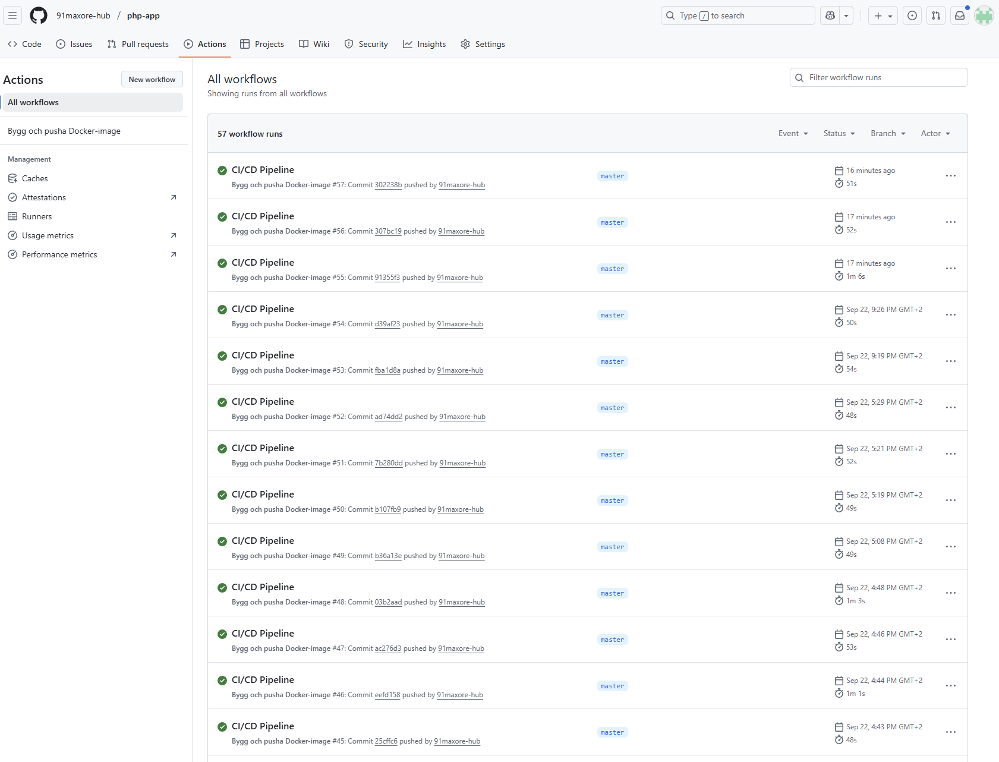

Dessutom en **status** som visar **Success**.  Exempel på ett lyckat arbetsflöde:

**build-and-push — Success**

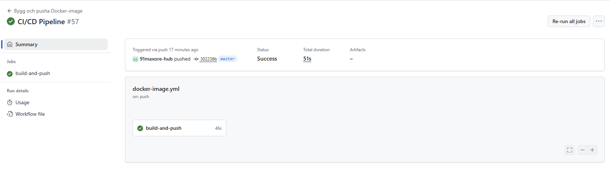


# ✅ Resultat

Efter att allt var uppsatt och CI/CD-deployment gick igenom kunde jag gå till:
🔗 https://wavvy.se

Min PHP-webapp laddas med giltigt SSL-certifikat, automatisk HTTPS och reverse proxy som hanterar trafiken smidigt.
Allt detta sker helt automatiskt – både deployment och certifikatförnyelse.

**Om man tittar på kravspecifikationen för uppgiften så är samtliga steg uppfyllda:**  
✅ Skapa en enkel webapp som du paketerar som en Docker-image  
✅ Laddar upp på Docker Hub  
✅ Körs i en Container Host  
✅ Använd Github Actions för att automatisera procesen  

# Användningen av Infrastructure as Code (IaC)

Jag använder Infrastructure as Code (IaC) genom att definiera applikationens infrastruktur med kod, främst med hjälp av Docker. Detta gör att applikationen kan köras likadant oavsett miljö.

Jag använder också GitHub Actions för att automatisera hela deployment-processen. När jag pushar till master-branchen byggs en Docker‑image automatiskt och deployas till min server via SSH. Det lagras inga hårdkodade värden i min kod som domännamn och SSH-nycklar, utan alla värden hanteras säkert med GitHub Secrets.

På så sätt är delar av infrastrukturen – främst allt som rör Docker - som containrar, webbserver och certifikat – definierade och hanterade genom kod. Detta gör det enklare att uppdatera miljön utan att göra allt manuellt.

<div style="margin-top: 800px;"></div>

# 🔒 Användning av säkerhet

1. **Inga hårdkodade värden i koden**  
   Alla känsliga uppgifter (som Docker Hub-inloggning och SSH-nycklar etc.) lagras säkert som **GitHub Secrets**, vilket gör att de aldrig syns i koden.

2. **Tvingad HTTPS**  
   nginx-konfiguration ser till att alla besökare automatiskt omdirigeras till **HTTPS** ifall dom försöker surfa in via http://wavvy.se vilket skyddar kommunikationen mellan användare och server, istället kommer dom omdirigeras till https://wavvy.se

3. **Automatiska SSL-certifikat**  
   Jag använder **Let's Encrypt** för att automatiskt få och förnya **SSL-certifikat**, utan manuell hantering.

4. **Reverse proxy**  
   Jag använder en **reverse proxy** som hanterar all inkommande trafik och kopplar rätt domän till rätt container – på ett säkert sätt.

5. **Isolerade Docker-containrar**  
   Applikationen körs i **Docker-containrar**, vilket gör att varje tjänst är isolerad från resten av systemet.

6. **Säker kommunikation mellan containrar via Docker-nätverk**  
   Alla tjänster är kopplade till samma isolerade Docker-nätverk (webnet), vilket gör att intern trafik sker privat och inte exponeras utanför container-hosten.

7. **Endast nödvändiga portar**  
   För att minska hoten utifrån är endast portarna 22 (SSH), 80 (HTTP) och 443 (HTTPS) öppna på container-hosten. Alla andra portar är stängda enligt bästa praxis, vilket begränsar exponeringen av tjänster och förbättrar säkerheten.

8. **Säker CI/CD-deployment**  
   Uppdatering av servern sker via **automatisk och säker SSH-anslutning** direkt från GitHub Actions, utan behov av manuell inloggning.

9. **Automatiska image-uppdateringar via CI/CD**  
   CI/CD-pipeline bygger och pushar en ny Docker-image varje gång kod ändras, vilket gör att du alltid kör den senaste versionen.

Anledningen till varför jag inte är behov av en **Bastion-host** är för att all serveruppdatering och deployment sker automatiskt genom GitHub Actions via CI/CD med säker SSH-nyckelautentisering.